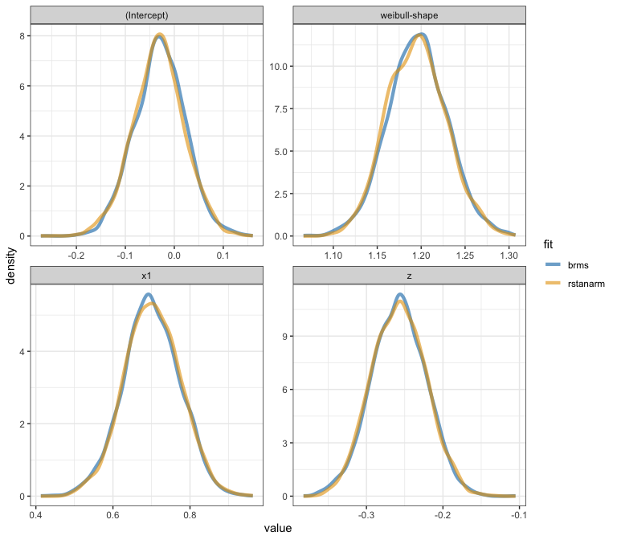

Weibull PH custom response distribution for brms
================

Andrea Discacciati

Karolinska Institutet, Sweden

Published: 2022-10-27

Last updated: 2022-11-04

------------------------------------------------------------------------

Functions to add to `brms` the **Weibull** custom response distribution
with **proportional-hazards** parametrisation.

$$
f(t; \mu, \gamma) = \mu \gamma t^{\gamma-1} \exp(-\mu t^{\gamma})
$$

$$
h(t; \mu, \gamma) = \mu \gamma t^{\gamma-1}
$$

where $\mu$ is the scale parameter and $\gamma$ is the shape parameter.

Functions can be `source`’d directly from R:

``` r
source("https://raw.githubusercontent.com/anddis/brms-weibullPH/main/weibullPH_funs.R")
```

``` r
library(brms)
library(rstanarm)
library(survival)
library(tidybayes)
library(tidyverse)

theme_set(theme_bw())
```

### Simulate right-censored survival data.

``` r
simdata <- local({
  set.seed(1901)
  N <- 1000
  x <- rbinom(N, 1, 0.5)
  z <- rnorm(N)
  y <- flexsurv::rweibullPH(N, 
                            shape =  1.2, # gamma
                            scale = exp(0 + log(2)*x + log(0.75)*z)) # mu
  cens <- runif(N, 0, 4)
  time <- pmin(y, cens)
  status <- as.numeric(y <= cens)
  data.frame(
    time = time,
    status = status,
    censored = 1 - status,
    x = factor(x),
    z = z
  )
})
```

### Fit Weibull PH model with `brms`.

``` r
formula_brms <- bf(time | cens(censored) ~ x + z,
           family = weibullPH)
fit_brms <- brm(formula_brms, 
                data = simdata,
                chains = 4,
                iter = 2000,
                stanvars = stanvars_weibullPH,
                prior = c(prior(normal(0, 20), class = Intercept),
                          prior(normal(0, sqrt(.5)), class = b),
                          prior(exponential(1), class = gamma)),
                seed = 1234,
                backend = "cmdstanr",
                refresh = 0)
```

    Start sampling

    Running MCMC with 4 sequential chains...

    Chain 1 finished in 2.0 seconds.
    Chain 2 finished in 1.8 seconds.
    Chain 3 finished in 2.0 seconds.
    Chain 4 finished in 2.0 seconds.

    All 4 chains finished successfully.
    Mean chain execution time: 1.9 seconds.
    Total execution time: 8.2 seconds.

### Model summary.

``` r
print(fit_brms, digits = 4)
```

     Family: weibullPH 
      Links: mu = log; gamma = identity 
    Formula: time | cens(censored) ~ x + z 
       Data: simdata (Number of observations: 1000) 
      Draws: 4 chains, each with iter = 2000; warmup = 1000; thin = 1;
             total post-warmup draws = 4000

    Population-Level Effects: 
              Estimate Est.Error l-95% CI u-95% CI   Rhat Bulk_ESS Tail_ESS
    Intercept  -0.0296    0.0522  -0.1341   0.0720 1.0007     3840     2752
    x1          0.7000    0.0733   0.5526   0.8408 1.0010     3870     3130
    z          -0.2579    0.0357  -0.3296  -0.1896 1.0007     4351     2876

    Family Specific Parameters: 
          Estimate Est.Error l-95% CI u-95% CI   Rhat Bulk_ESS Tail_ESS
    gamma   1.1958    0.0339   1.1284   1.2638 1.0009     4489     3178

    Draws were sampled using sample(hmc). For each parameter, Bulk_ESS
    and Tail_ESS are effective sample size measures, and Rhat is the potential
    scale reduction factor on split chains (at convergence, Rhat = 1).

### Expected survival.

Posterior expected survival by levels of `x`, given `z=0`.

``` r
es <- conditional_effects(fit_brms,
                    effects = "x",
                    conditions = data.frame(z = 0))
print(es$x, digits = 4)
```

      x   time censored z cond__ effect1__ estimate__    se__ lower__ upper__
    1 0 0.6082     0.22 0      1         0     0.9649 0.04150  0.8879  1.0501
    2 1 0.6082     0.22 0      1         1     0.5374 0.02228  0.4962  0.5834

``` r
es
```


True values:

``` r
c(1^(-1/1.2) * gamma(1+1/1.2), 2^(-1/1.2) * gamma(1+1/1.2))
```

    [1] 0.9406559 0.5279253

### Graphical posterior predictive checking.

Survival scale.

``` r
pp_check(fit_brms, 
         ndraws = 50, 
         type = "km_overlay", 
         status_y = simdata$status)
```


### Compare results from `brms` and `rstanarm`.

Both use Weibull PH parametrisation.

``` r
fit_rstanarm <- stan_surv(Surv(time, status) ~ x + z,
                  data = simdata,
                  basehaz = "weibull",
                  chains = 4,
                  iter = 2000,
                  seed = 1234,
                  prior = normal(0, sqrt(.5)),
                  prior_aux = exponential(1),
                  prior_intercept = normal(0, 20),
                  refresh = 0)
```

Posterior distributions.



### Simulate right-censored survival data with shared frailty.

Weibull with normally-distributed random effect (random intercept).
Equivalent to Weibull with log-normal shared frailty. Weibull PH
parametrisation.

100 clusters. 20 individuals per cluster.

``` r
simdata_me <- local({
  set.seed(19731)
  N_clusters <- 100
  N_individuals <- 20
  id <- seq(N_clusters * N_individuals)
  cluster_id <- rep(1:N_clusters, each = N_individuals)
  x <- rbinom(N_clusters * N_individuals, 1, 0.5)
  z <- sort(rep(rnorm(N_clusters, 0, sqrt(1.3)), each = N_individuals))
  y <- flexsurv::rweibullPH(N_clusters * N_individuals, 
                            shape =  1.2, # gamma
                            scale = exp(1 + log(2)*x + z)) # mu
  cens <- runif(N_clusters * N_individuals, 0, 4)
  time <- pmin(y, cens)
  status <- as.numeric(y <= cens)
  data.frame(
    id = id,
    cluster_id = cluster_id,
    time = time,
    status = status,
    censored = 1 - status,
    x = factor(x),
    z = z
  )
})
```

### Fit mixed-effect Weibull PH model with `brms`.

Random-intercept Weibull PH model.

$$
h_{ij}(t) = \exp(\beta_0 + \beta_1 x_{ij} + \alpha_{i}) \gamma t^{\gamma-1}, \alpha_i \sim N(0, \sigma^2)
$$

``` r
formula_brms_me <- bf(time | cens(censored) ~ x + (1 | cluster_id),
                   family = weibullPH)
fit_brms_me <- brm(formula_brms_me, 
                data = simdata_me,
                chains = 4,
                iter = 4000,
                stanvars = stanvars_weibullPH,
                prior = c(
                  prior(normal(0, 20), class = Intercept),
                  prior(normal(0, sqrt(.5)), class = b),
                  prior(exponential(1), class = gamma)
                  # leave default student-t prior on random effect
                ),
                seed = 2345,
                backend = "cmdstanr",
                refresh = 0,
                cores = 4)
```

    Start sampling

    Running MCMC with 4 parallel chains...

    Chain 1 finished in 32.6 seconds.
    Chain 2 finished in 32.7 seconds.
    Chain 3 finished in 38.1 seconds.
    Chain 4 finished in 38.5 seconds.

    All 4 chains finished successfully.
    Mean chain execution time: 35.5 seconds.
    Total execution time: 38.5 seconds.

### Model summary.

``` r
print(fit_brms_me, digits = 4)
```

     Family: weibullPH 
      Links: mu = log; gamma = identity 
    Formula: time | cens(censored) ~ x + (1 | cluster_id) 
       Data: simdata_me (Number of observations: 2000) 
      Draws: 4 chains, each with iter = 4000; warmup = 2000; thin = 1;
             total post-warmup draws = 8000

    Group-Level Effects: 
    ~cluster_id (Number of levels: 100) 
                  Estimate Est.Error l-95% CI u-95% CI   Rhat Bulk_ESS Tail_ESS
    sd(Intercept)   1.2187    0.0954   1.0484   1.4211 1.0019      823     1178

    Population-Level Effects: 
              Estimate Est.Error l-95% CI u-95% CI   Rhat Bulk_ESS Tail_ESS
    Intercept   1.0970    0.1295   0.8457   1.3550 1.0083      447     1062
    x1          0.6925    0.0504   0.5936   0.7909 1.0011     6689     5945

    Family Specific Parameters: 
          Estimate Est.Error l-95% CI u-95% CI   Rhat Bulk_ESS Tail_ESS
    gamma   1.2529    0.0237   1.2061   1.2984 1.0003     6544     6032

    Draws were sampled using sample(hmc). For each parameter, Bulk_ESS
    and Tail_ESS are effective sample size measures, and Rhat is the potential
    scale reduction factor on split chains (at convergence, Rhat = 1).

### Survival and hazard functions conditional on random effect.

Plot conditional survival and hazard functions for 20 clusters, sorted
by (true) frailty.


Hazards are proportional conditional on the random effect.


### Compare results from `brms` and `parfm`.

``` r
fit_parfm <- parfm::parfm(
  Surv(time, status) ~ x,
  cluster = "cluster_id",
  data = simdata_me,
  dist = "weibull",
  frailty = "lognormal"
)

print(fit_parfm)
```


    Frailty distribution: lognormal 
    Baseline hazard distribution: Weibull 
    Loglikelihood: 459.199 

           ESTIMATE SE    p-val    
    sigma2 1.418    0.217          
    rho    1.252    0.024          
    lambda 2.993    0.374          
    x1     0.695    0.051 <.001 ***
    ---
    Signif. codes: 0 '***' 0.001 '**' 0.01 '*' 0.05 '.' 0.1 ' ' 1

    Kendall's Tau: 0.347 

### Survival and hazard functions marginalised over random effect.

Compare `brms` results with `parfm` (black dashed lines) and true curves
(black dotted lines)


Hazards are not proportional when marginalised over the random effect.


### Session info.

``` r
sessionInfo()
```

    R version 4.2.0 Patched (2022-04-26 r82264)
    Platform: x86_64-apple-darwin17.0 (64-bit)
    Running under: macOS Mojave 10.14.6

    Matrix products: default
    BLAS:   /Library/Frameworks/R.framework/Versions/4.2/Resources/lib/libRblas.0.dylib
    LAPACK: /Library/Frameworks/R.framework/Versions/4.2/Resources/lib/libRlapack.dylib

    locale:
    [1] en_US.UTF-8/en_US.UTF-8/en_US.UTF-8/C/en_US.UTF-8/en_US.UTF-8

    attached base packages:
    [1] stats     graphics  grDevices utils     datasets  methods   base     

    other attached packages:
     [1] forcats_0.5.1   stringr_1.4.1   dplyr_1.0.10    purrr_0.3.5    
     [5] readr_2.1.2     tidyr_1.2.0     tibble_3.1.8    ggplot2_3.3.6  
     [9] tidyverse_1.3.2 tidybayes_3.0.2 survival_3.4-0  rstanarm_2.21.2
    [13] brms_2.18.0     Rcpp_1.0.9     

    loaded via a namespace (and not attached):
      [1] readxl_1.4.1         backports_1.4.1      sn_2.1.0            
      [4] plyr_1.8.7           igraph_1.3.5         mstate_0.3.2        
      [7] splines_4.2.0        svUnit_1.0.6         crosstalk_1.2.0     
     [10] optimx_2022-4.30     rstantools_2.2.0     inline_0.3.19       
     [13] digest_0.6.30        htmltools_0.5.3      fansi_1.0.3         
     [16] ggfortify_0.4.14     magrittr_2.0.3       checkmate_2.1.0     
     [19] googlesheets4_1.0.0  tzdb_0.3.0           flexsurv_2.2        
     [22] modelr_0.1.9         RcppParallel_5.1.5   matrixStats_0.62.0  
     [25] xts_0.12.1           prettyunits_1.1.1    colorspace_2.0-3    
     [28] rvest_1.0.2          ggdist_3.2.0         haven_2.5.0         
     [31] xfun_0.34            callr_3.7.2          crayon_1.5.2        
     [34] jsonlite_1.8.3       lme4_1.1-30          zoo_1.8-11          
     [37] glue_1.6.2           gtable_0.3.1         gargle_1.2.0        
     [40] distributional_0.3.1 pkgbuild_1.3.1       rstan_2.21.7        
     [43] abind_1.4-5          scales_1.2.1         mvtnorm_1.1-3       
     [46] DBI_1.1.2            miniUI_0.1.1.1       xtable_1.8-4        
     [49] deSolve_1.32         stats4_4.2.0         splines2_0.4.6      
     [52] StanHeaders_2.21.0-7 DT_0.25              htmlwidgets_1.5.4   
     [55] httr_1.4.3           threejs_0.3.3        RColorBrewer_1.1-3  
     [58] arrayhelpers_1.1-0   posterior_1.3.1      ellipsis_0.3.2      
     [61] pkgconfig_2.0.3      loo_2.5.1            farver_2.1.1        
     [64] dbplyr_2.1.1         utf8_1.2.2           labeling_0.4.2      
     [67] tidyselect_1.1.2     rlang_1.0.6          reshape2_1.4.4      
     [70] later_1.3.0          munsell_0.5.0        cellranger_1.1.0    
     [73] tools_4.2.0          cli_3.4.1            generics_0.1.3      
     [76] broom_1.0.1          ggridges_0.5.4       evaluate_0.17       
     [79] fastmap_1.1.0        yaml_2.3.6           processx_3.7.0      
     [82] knitr_1.40           fs_1.5.2             nlme_3.1-157        
     [85] mime_0.12            xml2_1.3.3           compiler_4.2.0      
     [88] bayesplot_1.9.0      shinythemes_1.2.0    rstudioapi_0.13     
     [91] reprex_2.0.1         statmod_1.4.37       stringi_1.7.8       
     [94] ps_1.7.1             Brobdingnag_1.2-9    lattice_0.20-45     
     [97] Matrix_1.5-1         nloptr_2.0.3         markdown_1.1        
    [100] shinyjs_2.1.0        tensorA_0.36.2       vctrs_0.4.2         
    [103] msm_1.6.9            pillar_1.8.1         lifecycle_1.0.3     
    [106] bridgesampling_1.1-2 data.table_1.14.2    httpuv_1.6.6        
    [109] parfm_2.7.6          R6_2.5.1             muhaz_1.2.6.4       
    [112] promises_1.2.0.1     gridExtra_2.3        codetools_0.2-18    
    [115] boot_1.3-28          colourpicker_1.1.1   MASS_7.3-57         
    [118] gtools_3.9.3         assertthat_0.2.1     withr_2.5.0         
    [121] mnormt_2.1.1         shinystan_2.6.0      expm_0.999-6        
    [124] parallel_4.2.0       hms_1.1.1            quadprog_1.5-8      
    [127] grid_4.2.0           coda_0.19-4          minqa_1.2.4         
    [130] cmdstanr_0.5.2       rmarkdown_2.17       googledrive_2.0.0   
    [133] numDeriv_2016.8-1.1  shiny_1.7.2          lubridate_1.8.0     
    [136] base64enc_0.1-3      dygraphs_1.1.1.6    
