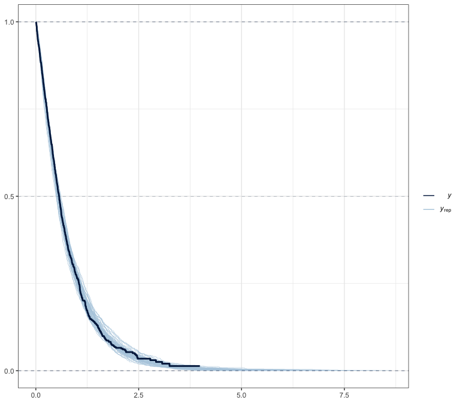

Weibull PH custom response distribution for brms
================

Andrea Discacciati

Karolinska Institutet, Sweden

Published: 2022-10-27

Last updated: 2022-10-28

------------------------------------------------------------------------

Functions to add to `brms` the **Weibull** custom response distribution
with **proportional-hazards** parametrisation.

$$f(t; \\mu, \\gamma) = \\mu \\gamma t^{\\gamma-1} \\exp(-\\mu t^{\\gamma})$$,

where $\\log(\\mu_i) = x_i^T\\beta$.

Functions can be `source`’d directly from R:

``` r
source("https://raw.githubusercontent.com/anddis/brms-weibullPH/main/weibullPH_funs.R")
```

``` r
library(brms)
library(rstanarm)
library(ggplot2)

theme_set(theme_bw())
```

### Simulate right-censored survival data.

``` r
set.seed(1901)
N <- 1000
x <- rbinom(N, 1, 0.5)
z <- rnorm(N)
y <- flexsurv::rweibullPH(N, 
                          shape =  1.2, # gamma
                          scale = exp(0 + log(2)*x + log(0.75)*z)) # mu
cens <- runif(N, 0, 4)
time <- pmin(y, cens)
status <- as.numeric(y <= cens)
simdata <- data.frame(
  time = time,
  status = status,
  censored = 1 - status,
  x = factor(x),
  z = z
)
rm(cens, N, x, status, time, y, z)
```

### Fit Weibull PH model with `brms`.

``` r
formula_brms <- bf(time | cens(censored) ~ x + z,
           family = weibullPH)
fit_brms <- brm(formula_brms, 
                data = simdata,
                chains = 4,
                iter = 2000,
                stanvars = stanvars_weibullPH,
                prior = c(prior(normal(0, 20), class = Intercept),
                          prior(normal(0, sqrt(.5)), class = b),
                          prior(exponential(1), class = gamma)),
                seed = 1234,
                backend = "cmdstanr",
                refresh = 0)
```

    Start sampling

    Running MCMC with 4 sequential chains...

    Chain 1 finished in 2.0 seconds.
    Chain 2 finished in 1.7 seconds.
    Chain 3 finished in 2.0 seconds.
    Chain 4 finished in 2.0 seconds.

    All 4 chains finished successfully.
    Mean chain execution time: 1.9 seconds.
    Total execution time: 8.0 seconds.

### Model summary.

``` r
print(fit_brms, digits = 4)
```

     Family: weibullPH 
      Links: mu = log; gamma = identity 
    Formula: time | cens(censored) ~ x + z 
       Data: simdata (Number of observations: 1000) 
      Draws: 4 chains, each with iter = 2000; warmup = 1000; thin = 1;
             total post-warmup draws = 4000

    Population-Level Effects: 
              Estimate Est.Error l-95% CI u-95% CI   Rhat Bulk_ESS Tail_ESS
    Intercept  -0.0296    0.0522  -0.1341   0.0720 1.0007     3840     2752
    x1          0.7000    0.0733   0.5526   0.8408 1.0010     3870     3130
    z          -0.2579    0.0357  -0.3296  -0.1896 1.0007     4351     2876

    Family Specific Parameters: 
          Estimate Est.Error l-95% CI u-95% CI   Rhat Bulk_ESS Tail_ESS
    gamma   1.1958    0.0339   1.1284   1.2638 1.0009     4489     3178

    Draws were sampled using sample(hmc). For each parameter, Bulk_ESS
    and Tail_ESS are effective sample size measures, and Rhat is the potential
    scale reduction factor on split chains (at convergence, Rhat = 1).

### Expected survival.

Posterior expected survival by levels of `x`, given `z=0`.

``` r
es <- conditional_effects(fit_brms,
                    effects = "x",
                    conditions = data.frame(z = 0))
print(es$x, digits = 4)
```

      x   time censored z cond__ effect1__ estimate__    se__ lower__ upper__
    1 0 0.6082     0.22 0      1         0     0.9649 0.04150  0.8879  1.0501
    2 1 0.6082     0.22 0      1         1     0.5374 0.02228  0.4962  0.5834

``` r
es
```


True values:

``` r
c(1^(-1/1.2) * gamma(1+1/1.2), 2^(-1/1.2) * gamma(1+1/1.2))
```

    [1] 0.9406559 0.5279253

### Graphical posterior predictive checking.

Survival scale.

``` r
pp_check(fit_brms, 
         ndraws = 50, 
         type = "km_overlay", 
         status_y = simdata$status)
```



### Compare results from `brms` and `rstanarm`.

Both use Weibull PH parametrisation.

``` r
fit_rstanarm <- stan_surv(Surv(time, status) ~ x + z,
                  data = simdata,
                  basehaz = "weibull",
                  chains = 4,
                  iter = 2000,
                  seed = 1234,
                  prior = normal(0, sqrt(.5)),
                  prior_aux = exponential(1),
                  prior_intercept = normal(0, 20),
                  refresh = 0)
```

Posterior distributions.


### Session info

``` r
sessionInfo()
```

    R version 4.2.0 Patched (2022-04-26 r82264)
    Platform: x86_64-apple-darwin17.0 (64-bit)
    Running under: macOS Mojave 10.14.6

    Matrix products: default
    BLAS:   /Library/Frameworks/R.framework/Versions/4.2/Resources/lib/libRblas.0.dylib
    LAPACK: /Library/Frameworks/R.framework/Versions/4.2/Resources/lib/libRlapack.dylib

    locale:
    [1] en_US.UTF-8/en_US.UTF-8/en_US.UTF-8/C/en_US.UTF-8/en_US.UTF-8

    attached base packages:
    [1] stats     graphics  grDevices utils     datasets  methods   base     

    other attached packages:
    [1] ggplot2_3.3.6   rstanarm_2.21.2 brms_2.18.0     Rcpp_1.0.9     

    loaded via a namespace (and not attached):
      [1] minqa_1.2.4          colorspace_2.0-3     ellipsis_0.3.2      
      [4] ggridges_0.5.4       markdown_1.1         base64enc_0.1-3     
      [7] rstudioapi_0.13      farver_2.1.1         rstan_2.21.7        
     [10] DT_0.25              fansi_1.0.3          mvtnorm_1.1-3       
     [13] bridgesampling_1.1-2 codetools_0.2-18     splines_4.2.0       
     [16] knitr_1.40           shinythemes_1.2.0    bayesplot_1.9.0     
     [19] jsonlite_1.8.2       nloptr_2.0.3         shiny_1.7.2         
     [22] compiler_4.2.0       backports_1.4.1      assertthat_0.2.1    
     [25] Matrix_1.5-1         fastmap_1.1.0        cli_3.4.1           
     [28] later_1.3.0          htmltools_0.5.3      prettyunits_1.1.1   
     [31] tools_4.2.0          igraph_1.3.5         coda_0.19-4         
     [34] gtable_0.3.1         glue_1.6.2           reshape2_1.4.4      
     [37] dplyr_1.0.10         posterior_1.3.1      vctrs_0.4.2         
     [40] nlme_3.1-157         crosstalk_1.2.0      tensorA_0.36.2      
     [43] xfun_0.33            stringr_1.4.1        ps_1.7.1            
     [46] lme4_1.1-30          mime_0.12            miniUI_0.1.1.1      
     [49] lifecycle_1.0.3      gtools_3.9.3         statmod_1.4.37      
     [52] muhaz_1.2.6.4        MASS_7.3-57          zoo_1.8-11          
     [55] scales_1.2.1         colourpicker_1.1.1   promises_1.2.0.1    
     [58] Brobdingnag_1.2-9    parallel_4.2.0       inline_0.3.19       
     [61] shinystan_2.6.0      yaml_2.3.5           gridExtra_2.3       
     [64] loo_2.5.1            StanHeaders_2.21.0-7 stringi_1.7.8       
     [67] dygraphs_1.1.1.6     checkmate_2.1.0      boot_1.3-28         
     [70] pkgbuild_1.3.1       cmdstanr_0.5.2       rlang_1.0.6         
     [73] pkgconfig_2.0.3      matrixStats_0.62.0   distributional_0.3.1
     [76] evaluate_0.17        lattice_0.20-45      purrr_0.3.5         
     [79] splines2_0.4.6       labeling_0.4.2       rstantools_2.2.0    
     [82] htmlwidgets_1.5.4    processx_3.7.0       tidyselect_1.1.2    
     [85] deSolve_1.32         plyr_1.8.7           magrittr_2.0.3      
     [88] R6_2.5.1             generics_0.1.3       DBI_1.1.2           
     [91] pillar_1.8.1         withr_2.5.0          xts_0.12.1          
     [94] survival_3.4-0       abind_1.4-5          ggfortify_0.4.14    
     [97] tibble_3.1.8         mstate_0.3.2         crayon_1.5.2        
    [100] utf8_1.2.2           rmarkdown_2.16       grid_4.2.0          
    [103] data.table_1.14.2    callr_3.7.2          threejs_0.3.3       
    [106] digest_0.6.29        xtable_1.8-4         tidyr_1.2.0         
    [109] httpuv_1.6.6         numDeriv_2016.8-1.1  RcppParallel_5.1.5  
    [112] stats4_4.2.0         munsell_0.5.0        flexsurv_2.2        
    [115] quadprog_1.5-8       shinyjs_2.1.0       
